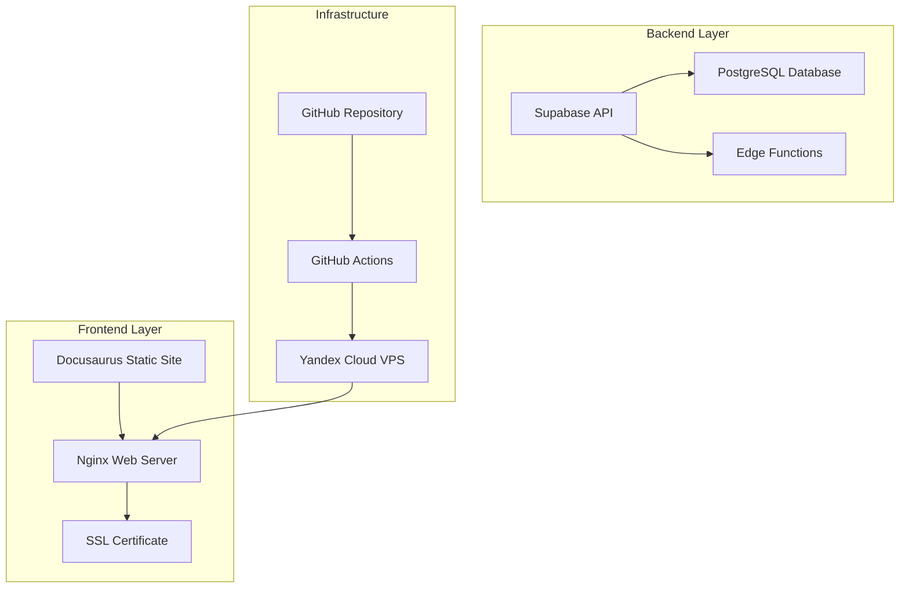

# 🚀 Путеводитель по Мексике - "Путешествие сквозь время от ковбоев до древних майя"

[](https://github.com/your-username/mexica-travel-guide)
[](https://docusaurus.io/)
[](LICENSE)

> **Вдохновляющий путеводитель по Мексике, сочетающий авторские рассказы о путешествиях с практическими советами для планирования поездки**

## 📖 О проекте

**"Путеводитель по Мексике"** — это современный веб-сайт, построенный на платформе [Docusaurus](https://docusaurus.io/), который служит одновременно:

- 🎭 **Личным блогом** с увлекательными рассказами о путешествиях
- 🗺️ **Практическим руководством** для планирования поездки в Мексику
- 📚 **Информационным ресурсом** о культуре, истории и достопримечательностях

Проект создан с целью превратить разрозненные заметки и идеи в структурированный, удобный и привлекательный веб-ресурс, который вдохновляет на путешествия и предоставляет практическую информацию.

## 🎯 Цели проекта

- **Вдохновить** читателей на путешествия по Мексике
- **Предоставить** практическую информацию для планирования поездки
- **Создать** авторитетный русскоязычный ресурс о Мексике


## 🏗️ Архитектура проекта

### Технологический стек

```
Frontend: Docusaurus 3.0 + React + MDX
Backend: Supabase (PostgreSQL + Edge Functions)
Hosting: Yandex Cloud VPS + Nginx
CI/CD: GitHub Actions + Auto-deploy
```

### Архитектурная схема



## 📁 Структура проекта

```
mexica-travel-guide/
├── docs/                          # Документация проекта
│   ├── architecture.md            # Техническая архитектура
│   ├── prd.md                     # Требования к продукту
│   └── project-brief.md           # Проектный бриф
├── src/                           # Исходный код Docusaurus
│   ├── components/                # React компоненты
│   ├── pages/                     # Статические страницы
│   ├── blog/                      # Блог посты (MDX)
│   └── docs/                      # Документация/путеводитель
├── static/                        # Статические файлы
│   ├── img/                       # Изображения
│   └── assets/                    # Другие ресурсы
├── Templates/                     # Шаблоны для контента
├── .obsidian/                     # Obsidian конфигурация
└── README.md                      # Этот файл
```

## 🚀 Быстрый старт

### Предварительные требования

- Node.js 18+ 
- npm или yarn
- Git

### Установка и запуск

```bash
# Клонирование репозитория
git clone https://github.com/your-username/mexica-travel-guide.git
cd mexica-travel-guide

# Установка зависимостей
npm install

# Запуск в режиме разработки
npm run start

# Сборка для продакшена
npm run build

# Локальный предпросмотр продакшн сборки
npm run serve
```

### Переменные окружения

Создайте файл `.env.local` в корне проекта:

```env
# Supabase конфигурация
SUPABASE_URL=your_supabase_url
SUPABASE_ANON_KEY=your_supabase_anon_key

# Другие переменные
SITE_URL=https://your-domain.com
```

## 📝 Создание контента

### Добавление блог поста

1. Создайте новый MDX файл в `src/blog/`
2. Используйте следующий шаблон:

```mdx
---
slug: nazvanie-posta
title: Название поста
authors: [author]
tags: [mexica, puteshestviya, maya]
---

Содержание поста в формате MDX...
```

### Добавление страницы путеводителя

1. Создайте новый MDX файл в `src/docs/`
2. Добавьте в `sidebars.js` для навигации
3. Используйте Markdown для структурирования

## 🎨 Кастомизация

### Темы и стили

- Основные стили: `src/css/custom.css`
- Компоненты: `src/components/`
- Шаблоны страниц: `src/pages/`

### Цветовая палитра

```css
:root {
  --mexica-terracotta: #E07A5F;
  --mexica-sand: #F2E8CF;
  --mexica-turquoise: #81B29A;
  --mexica-jungle: #3D405B;
}
```

## 🚀 Развертывание

### Автоматическое развертывание

Проект настроен на автоматическое развертывание через GitHub Actions:

1. **Push в main** → автоматическая сборка и деплой
2. **Push в feature branch** → создание preview деплоя
3. **Pull Request** → автоматические тесты

### Ручное развертывание

```bash
# Сборка проекта
npm run build

# Копирование файлов на сервер
rsync -avz build/ user@server:/var/www/html/

# Перезапуск Nginx
ssh user@server "sudo systemctl reload nginx"
```

## 📊 Мониторинг и аналитика

- **Производительность**: Core Web Vitals мониторинг
- **Аналитика**: Google Analytics 4
- **Логи**: Nginx access/error logs
- **Uptime**: Мониторинг доступности сайта

## 🔧 Разработка

### Команды разработки

```bash
npm run start          # Запуск dev сервера
npm run build          # Сборка для продакшена
npm run serve          # Предпросмотр сборки
npm run clear          # Очистка кэша
npm run swizzle        # Кастомизация компонентов
```

### Структура компонентов

```
src/components/
├── Layout/            # Компоненты макета
├── Blog/              # Компоненты блога
├── Guide/             # Компоненты путеводителя
└── Common/            # Общие компоненты
```

## 🧪 Тестирование

```bash
# Запуск тестов
npm test

# Проверка линтера
npm run lint

# Проверка типов (если используется TypeScript)
npm run type-check
```

## 📚 Документация

- [Архитектура проекта](docs/architecture.md)
- [Требования к продукту](docs/prd.md)
- [Проектный бриф](docs/project-brief.md)
- [Docusaurus документация](https://docusaurus.io/docs)

## 🤝 Вклад в проект

1. Fork репозитория
2. Создайте feature branch (`git checkout -b feature/amazing-feature`)
3. Commit изменения (`git commit -m 'Add amazing feature'`)
4. Push в branch (`git push origin feature/amazing-feature`)
5. Откройте Pull Request

## 📄 Лицензия

Этот проект распространяется под лицензией MIT. См. файл [LICENSE](LICENSE) для подробностей.

## 👥 Команда

- **Автор и разработчик**: Остап Бендер
- **Бизнес-аналитик**: Мэри Бендер (AI агент)
- **Архитектор**: Артем Бендер (AI агент)

## 🆘 Поддержка

Если у вас есть вопросы или проблемы:

- 📧 Email: [i@bashroo.ru]
- 🐛 Issues: [GitHub Issues](https://github.com/CentOsss/mexica-travel-guied/issues)
- 📖 Документация: [docs/](docs/)

## 🎉 Благодарности

- [Docusaurus](https://docusaurus.io/) за отличную платформу
- [Supabase](https://supabase.com/) за backend-as-a-service
- Сообщество разработчиков за вдохновение и поддержку
- ИИ агенты за вдохновение и поддержку

---

**⭐ Если проект вам понравился, поставьте звездочку на GitHub!**

*Создано с ❤️ для путешественников*