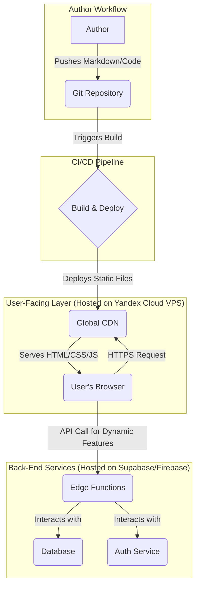
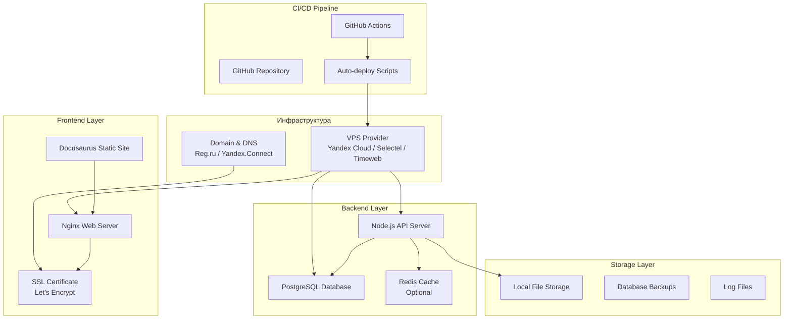
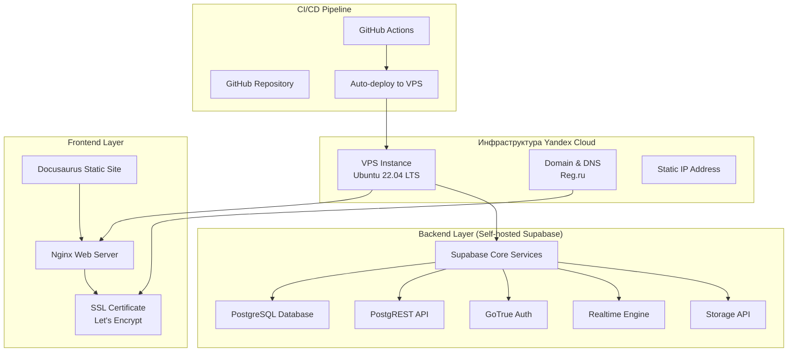

# Architecture
---

### **Section 1: Introduction and Vision**

#### **Drafted Content**

**1.1. Project Overview**
The "Дороги и Горизонты" (Roads and Horizons) project is a content-driven web application designed to serve as a personal travel blog. Its primary purpose is to deliver a rich, engaging, and fast user experience for readers, while providing a simple and efficient content management workflow for the author.

**1.2. Target Audience**
The primary audience consists of individuals interested in travel, photography, and cultural exploration. They are expected to access the site from a variety of devices, including desktops, tablets, and smartphones, often with varying network conditions. The architecture must prioritize performance and accessibility for this global audience.

**1.3. Core Technical Vision**
The technical vision is to build a scalable, secure, and maintainable full-stack application using a modern, component-based architecture. We will employ a "Jamstack-like" approach for the front-end to ensure optimal performance and user experience, backed by a flexible and decoupled back-end service for dynamic features and content management. The system will be designed for cloud-native deployment, emphasizing automation, monitoring, and ease of maintenance.

---

#### **My Rationale**

*   **Problem Statement:** I've framed the project not just as a "blog" but as a "content-driven web application." This encourages us to think about future-proofing and potential features beyond simple posts (e.g., interactive maps, photo galleries, user comments).
*   **Audience-Driven Design:** By explicitly mentioning device variety and network conditions, I'm setting the stage for key architectural decisions like responsive design, image optimization, and the use of a Content Delivery Network (CDN).
*   **"Jamstack-like" Approach:** I've chosen this term carefully. While we are building a full-stack app, the principle of pre-rendering the front-end (like Docusaurus does) is a powerful pattern for performance. This immediately signals a decoupled architecture where the front-end and back-end are separate concerns, which is a cornerstone of modern, scalable design.
*   **Cloud-Native:** This sets an expectation for leveraging cloud services (e.g., for hosting, database, authentication) rather than building everything from scratch, which aligns with pragmatic and cost-conscious engineering.
Excellent. Let's move on to establishing the foundational rules that will guide our design. These principles and constraints will act as our constitution for all subsequent architectural decisions.

---

### **Section 2: Architectural Principles and Constraints**

#### **Drafted Content**

**2.1. Guiding Principles**
The following principles will guide all technical and design decisions for the "Дороги и Горизонты" project:

*   **Performance First:** The application must be exceptionally fast. We will prioritize sub-second load times and a fluid user experience. This involves aggressive optimization, caching, and efficient data loading.
*   **Simplicity & Maintainability:** The system should be as simple as possible, but no simpler. We will favor "boring" and well-understood technologies to ensure the solo author can easily manage, update, and debug the entire stack.
*   **Security by Design:** Security is not an afterthought. We will implement security best practices at every layer, from front-end dependencies to back-end API endpoints and infrastructure configuration.
*   **Decoupled Systems:** The front-end (presentation layer) and back-end (data/logic layer) will be developed and deployed independently. This separation of concerns improves maintainability, allows for independent scaling, and provides future flexibility.
*   **Stateless Services:** Whenever possible, back-end services will be stateless. This simplifies horizontal scaling, improves resilience, and aligns with modern cloud-native deployment patterns.

**2.2. Constraints**

*   **Technology Constraint (Core):** The front-end is built upon the **Docusaurus framework**. All front-end architectural decisions must integrate with or extend Docusaurus's capabilities.
*   **Operational Constraint:** The project will be managed and maintained by a **single author/developer**. The architecture must minimize operational overhead and cognitive load. This heavily influences the choice of managed services over self-hosted solutions.
*   **Content Constraint:** The primary content is long-form articles with embedded images. The architecture must efficiently handle image optimization, storage, and delivery.
*   **Budget Constraint:** The project operates on a minimal budget. We will prioritize free tiers and low-cost, pay-as-you-go cloud services.

---

#### **My Rationale**

*   **Why these principles?**
    *   `Performance First` directly addresses the target audience's needs and is a key differentiator for modern web apps.
    *   `Simplicity & Maintainability` is the most critical principle given the `Operational Constraint` of a solo operator. This principle will guide us to reject overly complex solutions, even if they are technically interesting.
    *   `Security by Design` is a non-negotiable baseline for any public-facing application.
    *   `Decoupled Systems` and `Stateless Services` are technical implementations of the "Simplicity" and "Performance" principles. They are standard best practices for building scalable and resilient applications.
*   **Why these constraints?**
    *   I've explicitly called out `Docusaurus` as a hard constraint. This is vital because it dictates our front-end reality: a static site generator using React.
    *   The `Solo Operator` constraint is the most impactful one. It forces us to think about the total cost of ownership, not just the initial build. This means automation and managed services are our best friends.
    *   The `Content` and `Budget` constraints are practical realities that will shape our choices for things like image hosting (e.g., use a free service vs. a dedicated image server) and hosting platforms.

---

These principles and constraints form the guardrails for our project. Do they accurately capture the project's reality and goals?

Excellent. Now we will define the high-level structure of the entire system. This diagram and description will serve as our map for the rest of the design process.

---

### **Section 3: System Architecture Overview**

#### **Drafted Content**

**3.1. High-Level Architecture Diagram**


```mermaid
graph TD
    subgraph "Author Workflow"
        A[Author] -- Pushes Markdown/Code --> G(Git Repository);
    end

    subgraph "CI/CD Pipeline"
        G -- Triggers Build --> CI{Build & Deploy};
    end

    subgraph "User-Facing Layer (Hosted on Yandex Cloud VPS)"
        CI -- Deploys Static Files --> CDN(Global CDN);
        U(User's Browser) -- HTTPS Request --> CDN;
        CDN -- Serves HTML/CSS/JS --> U;
    end

    subgraph "Back-End Services (Hosted on Supabase/Firebase)"
        U -- API Call for Dynamic Features --> API(Edge Functions);
        API -- Interacts with --> DB(Database);
        API -- Interacts with --> AS(Auth Service);
    end

    style A icon:fa-user
    style U icon:fa-user
    style G icon:fa-git-alt
    style CI icon:fa-cogs
    style CDN icon:fa-globe
    style API icon:fa-server
    style DB icon:fa-database
    style AS icon:fa-key
```

**3.2. Component Descriptions**

*   **Front-End Application (Docusaurus):**
    *   **Description:** This is the user-facing website, built as a static site using Docusaurus. It is responsible for rendering all blog posts, pages, and the overall user interface. It fetches pre-built HTML from the CDN for initial loads, then hydrates into a full React application for client-side interactivity.
    *   **Responsibilities:** Content display, navigation, UI/UX, and making API calls to the back-end for any features that require dynamic data (e.g., a future comment section).

*   **Back-End Services (Serverless Functions):**
    *   **Description:** A set of lightweight, stateless functions that provide dynamic capabilities not handled by the static site. This is intentionally separated from the core content site to maintain high performance and security for the static assets.
    *   **Responsibilities:** Handling contact form submissions, managing user authentication (for potential future features like a "like" button or comments), and serving any other dynamic data.

*   **Infrastructure & Hosting:**
    *   **Front-End Hosting (VPS-curich-schweitsarian):** The Docusaurus site will be hosted on a platform specializing in static/Jamstack deployments. These platforms provide a global CDN, automated CI/CD from a Git repository, and instant rollbacks out-of-the-box.
    *   **Back-End Platform (Yandex Cloud):** We will use a "Backend-as-a-Service" (BaaS) platform. These platforms provide a suite of managed services including a database, authentication, and serverless functions (Edge Functions), all accessible via a simple API. This dramatically reduces operational overhead.

**3.3. Data Flow**
1.  **Content Creation:** The author writes a blog post in a Markdown file and pushes the commit to a Git repository (e.g., GitHub).
2.  **Build & Deploy:** This push automatically triggers github actions (or gitlab-ci?)a build process on VPS-curich-schweitsarian. Docusaurus compiles the Markdown and React components into optimized, static HTML, CSS, and JavaScript files.
3.  **Content Delivery:** The static files are deployed and distributed across the global CDN.
4.  **User Access:** When a user visits the site, they are served the static files from the nearest CDN edge location, ensuring the fastest possible load time.
5.  **Dynamic Interaction:** If the user interacts with a dynamic feature (e.g., submits a form), the client-side JavaScript makes a secure API call to the back-end Edge Function, which processes the request.

---

#### **My Rationale**

*   **Alignment with Principles:** This architecture is the direct result of our established principles.
    *   `Decoupled Systems`: The front-end and back-end are completely separate codebases and are deployed independently.
    *   `Performance First`: Serving the core site from a CDN is the gold standard for web performance.
    *   `Simplicity & Maintainability`: Using Vercel and Supabase/Firebase abstracts away nearly all infrastructure management. The author only needs to manage their Docusaurus code and their serverless function code, not servers, databases, or build pipelines.
*   **Technology Choices:**
    *   **Vercel/Netlify:** These are industry leaders for this type of architecture. They are built for this exact workflow and their free tiers are more than sufficient for this project's needs, satisfying the `Budget Constraint`.
    *   Yandex Cloud:** I'm suggesting a BaaS platform because it bundles together the database, auth, and functions. This is a massive simplification for a `Solo Operator`. Instead of wiring together three separate services, we get one integrated dashboard and SDK.
*   **Risk Mitigation:** This design minimizes risk. The static site is highly resilient and can handle huge traffic spikes with no change in performance. The back-end is isolated, so a bug in a serverless function cannot bring down the main content site.

---


### **Section 4: Front-End Architecture**

#### **Drafted Content**

**4.1. Technology Stack**

*   **Framework:** **Docusaurus v3+** - The core of our front-end. We will leverage its file-based routing, content-first features (MDX), and theming capabilities.
*   **Language:** **TypeScript** - For type safety and improved developer experience, especially as we add custom components and logic.
*   **Styling:** **CSS Modules with Infima** - We will use Docusaurus's built-in Infima styling framework for the base theme and supplement it with CSS Modules for custom components. This approach scopes styles locally to components, preventing CSS conflicts and keeping the global scope clean.
*   **Content:** **MDX (Markdown with JSX)** - This is crucial. It allows the author to embed custom React components directly within blog posts, enabling rich, interactive content beyond static text and images.

**4.2. Component Strategy**

We will adopt a simplified Atomic Design philosophy, tailored for Docusaurus:

*   **Atoms:** The smallest, indivisible UI elements. These will mostly be provided by Docusaurus's Infima framework (e.g., buttons, form inputs, alerts). We will only create new atoms if absolutely necessary.
*   **Molecules:** Simple components composed of atoms. Examples: a custom `ImageCarousel` component, a `NewsletterSignup` form, or a `CodeBlockWithCopy` button. These are the primary components the author will embed in MDX files.
*   **Organisms:** Larger, more complex components that combine molecules. Example: A `RelatedArticles` section at the bottom of a post, which might fetch data and display a list of article preview cards (molecules).
*   **Templates/Pages:** The overall layout structures, largely controlled by Docusaurus's theming system (e.g., the blog post page layout, the landing page). We will customize these by "swizzling" Docusaurus components.

All custom components will reside in the `src/components/` directory, organized by this structure.

**4.3. State Management**

*   **Global State:** For a primarily static site, complex global state management (like Redux or MobX) is unnecessary and violates our "Simplicity" principle. Global state (e.g., theme preference like dark/light mode) will be managed by Docusaurus's built-in mechanisms.
*   **Component State:** For interactive components (e.g., a contact form), we will use standard React Hooks (`useState`, `useEffect`).
*   **Server Cache State:** For data fetched from our back-end API, we will use a lightweight library like **SWR** or **React Query**. These hooks-based libraries simplify data fetching, caching, and re-validation, providing a better user experience (e.g., showing stale data while re-fetching) and preventing redundant API calls.

**4.4. API Communication**

*   All communication with our back-end services will be done client-side via HTTPS requests.
*   We will use a standard like `fetch` or a lightweight wrapper like `axios` for making API calls.
*   API client logic will be encapsulated in custom hooks (e.g., `useContactForm()`) to keep components clean and separate UI from data-fetching logic.
*   Environment variables (e.g., the API endpoint URL) will be managed securely using Docusaurus's built-in support for `.env` files, prefixed with `DOCUSAURUS_`.

---

#### **My Rationale**

*   **Leveraging Docusaurus:** This entire section is designed to work *with* Docusaurus, not against it. We are using its styling system (Infima), its component model (swizzling), and its content format (MDX). This reduces the amount of custom code we need to write and maintain.
*   **Pragmatic Component Strategy:** A full-blown Atomic Design system can be overkill. This simplified version provides a clear structure for organizing components without being overly rigid, which is perfect for a `Solo Operator`.
*   **Right-Sized State Management:** I've explicitly rejected complex state management libraries. They are a common source of bugs and complexity. For our needs, React's built-in state and a dedicated data-fetching library are the perfect tools for the job, aligning with the `Simplicity` principle.
*   **Clean API Layer:** Using custom hooks for API calls is a modern React best practice. It makes our UI components declarative; they just ask for the data they need, and the hook handles the messy details of fetching, loading states, and errors.

---

### **Section 5: Back-End Architecture**

#### **Drafted Content**

**5.1. Technology Stack**

*   **Platform:** **Self-hosted Supabase on Yandex Cloud VPS** - We will deploy Supabase directly on our VPS infrastructure. This gives us the benefits of Supabase (PostgreSQL database, authentication, Edge Functions) while maintaining full control over our data and infrastructure within the Russian cloud ecosystem.
*   **Database:** **PostgreSQL** - A powerful, open-source, and reliable relational database provided out-of-the-box by Supabase.
*   **Serverless Functions:** **Deno Edge Functions** - Written in **TypeScript**, these are globally distributed serverless functions that run on Deno. Using TypeScript provides language consistency with our front-end.
*   **Authentication:** **Supabase Auth** - A built-in service that handles user management and JWT (JSON Web Token) issuance.

**5.2. API Design**

*   **Style:** We will implement a pragmatic **RESTful API**. Each dynamic feature will correspond to a dedicated Edge Function, creating a clear and single-purpose set of endpoints.
*   **Data Format:** All API endpoints will accept and respond with **JSON**.
*   **Example Endpoints (v1):**
    *   `POST /api/contact`: Accepts a JSON payload with contact form data, validates it, and saves it to the database.
*   **Example Endpoints (Future):**
    *   `POST /api/posts/{postId}/like`: An authenticated endpoint to "like" a post.
    *   `GET /api/posts/{postId}/comments`: An endpoint to fetch comments for a post.
*   **Security:** API access will be controlled via Supabase's API Gateway, using Row Level Security (RLS) on the database for fine-grained data access control.

**5.3. Database Schema**

The initial database schema will be minimal, designed to support the first set of features and evolve as needed.

*   **`contact_submissions` table:**
    *   `id` (uuid, primary key)
    *   `created_at` (timestamp with time zone)
    *   `name` (text)
    *   `email` (text, validated)
    *   `message` (text)
    *   `is_read` (boolean, default: false)

*   **Future tables** (e.g., `comments`, `post_metadata`) can be easily added via the Supabase dashboard as new features are developed. The author can view and manage submissions directly in the Supabase UI, eliminating the need to build a custom admin panel.

**5.4. Authentication and Authorization**

*   **Initial Scope (v1):** The public-facing site is fully anonymous. No user login is required.
*   **Author Access:** The author will interact with the database (e.g., to read contact submissions) by logging directly into the secure Supabase dashboard. This is the simplest and most secure approach.
*   **Future User Authentication:** When features like comments or post "likes" are introduced, Supabase Auth will be used. The flow will be:
    1.  User signs up/logs in on the front-end via a social provider (e.g., Google, GitHub) or email.
    2.  Supabase Auth returns a JWT to the client.
    3.  The client stores the JWT securely and includes it in the `Authorization` header for all subsequent API requests to protected endpoints.
    4.  The Edge Function verifies the JWT before executing its logic.

---

#### **My Rationale**

*   **The "Why Supabase?" Question:** For a `Solo Operator` on a `Budget`, a BaaS is a game-changer. Supabase bundles the database, auth, and serverless functions into one cohesive, managed platform. This eliminates the need to configure, secure, and maintain three separate services and their integrations. It's the ultimate embodiment of our `Simplicity & Maintainability` principle.
*   **REST over GraphQL:** While GraphQL is powerful, it's overkill here. It adds a layer of complexity (schemas, resolvers) that isn't justified by our simple API needs. A set of single-purpose REST endpoints is easier to build, debug, and reason about.
*   **No Custom Admin Panel:** Building and securing an admin panel is a significant amount of work. By leveraging the Supabase dashboard, we get a secure, feature-rich interface for free, allowing the author to focus on content creation, not tool-building.
*   **Security First:** This design leverages mature, battle-tested components for security. Supabase Auth handles the complexities of authentication, and PostgreSQL's Row Level Security is a robust mechanism for ensuring users can only access data they are permitted to see.

---

### **Section 6: Data Management and Storage**

#### **Drafted Content**

**6.1. Content Workflow (Markdown as Source of Truth)**

*   **Source Control:** All content (blog posts as `.mdx` files) and code will be stored and versioned in a **Git repository** (e.g., on GitHub). Git provides a complete history of all changes, the ability to work on new posts in separate branches, and serves as the trigger for our automated deployment pipeline.
*   **Local Development:** The author will use the `docusaurus start` command to run a local, hot-reloading web server. This allows for real-time previews of content and design changes before they are committed.
*   **Publishing Flow:**
    1.  Author creates a new post: `git checkout -b new-blog-post`.
    2.  Author writes the post in their preferred code editor.
    3.  Author commits changes: `git commit -m "feat: add new post about X"`.
    4.  Author merges the branch into `main`: `git checkout main; git merge new-blog-post`.
    5.  Author pushes to the remote repository: `git push origin main`.
    6.  This push automatically triggers the build and deploy process on Vercel/Netlify, making the post live within minutes.

**6.2. Image & Static Asset Management**

*   **Storage Strategy:** All images will be stored directly within the Git repository in the `static/img` directory, as recommended by Docusaurus.
    *   **Rationale:** For a project of this scale, this is the simplest approach. It keeps content and images coupled, simplifies the authoring workflow (no need to upload to a separate service), and leverages the same version control as the content.
*   **Optimization:**
    *   **Automated Optimization:** We will use the `docusaurus-plugin-image-optimization` plugin. During the production build (`CI/CD Pipeline`), this plugin will automatically compress and resize images (JPEG, PNG, WebP) without any manual effort from the author.
    *   **Modern Formats:** The plugin will be configured to generate **WebP** versions of images, which offer superior compression and quality compared to older formats. The front-end will serve the WebP version to compatible browsers, with a fallback to JPEG/PNG for older browsers.
*   **Delivery:** Images are served through the same **Global CDN** as the rest of the static site files, ensuring fast delivery to users worldwide.

**6.3. Database Management**

*   **Backups:** Supabase provides automated daily backups of the PostgreSQL database. This is a key benefit of using a managed BaaS platform and satisfies our need for disaster recovery without manual intervention.
*   **Schema Migrations:** For a solo developer, schema changes can be managed directly through the Supabase UI for simplicity. For more complex changes or a more rigorous workflow, Supabase supports a code-based migration workflow using their CLI, which can be integrated into the Git repository. We will start with UI-based changes and adopt the CLI if the need arises.
*   **Data Access:** As defined in the Back-End section, all data in the database will be accessed via the secure API provided by Edge Functions, governed by PostgreSQL's Row Level Security policies. Direct database access from the public internet is disabled by default.

---

#### **My Rationale**

*   **Simplicity is Key:** The entire workflow is optimized for a `Solo Operator`. Storing images and content in Git removes the need for a separate CMS or media library, reducing complexity and cost. The author only needs to know Git and Markdown.
*   **Performance-Oriented:** The image optimization strategy is critical for meeting our `Performance First` principle. Unoptimized images are the most common cause of slow page loads. Automating this process ensures every image is served in the most efficient format and size possible.
*   **Zero-Overhead Backups:** Database backups are a critical but often overlooked task. By relying on the managed service (Supabase), we get this crucial safety net for free, with no setup or maintenance required from the author.
*   **Control and Flexibility:** While we are starting with the simplest approach (UI-based schema changes), the architecture doesn't lock us in. We have a clear path to a more robust, code-based migration strategy if the project's complexity grows.


### **Section 7: CI/CD and Deployment**

#### **Drafted Content**

**7.1. CI/CD Provider**

*   **Platform:** **Yandex Cloud VPS with Nginx** - We will deploy our Docusaurus site directly on our VPS using Nginx as a web server. This provides full control over our hosting environment while maintaining the performance benefits of static site generation.
*   **Integration:** Vercel will be linked directly to our Git repository (e.g., GitHub).
*   **Trigger:** Every `git push` to the `main` branch will automatically trigger a production build and deployment. Pushes to any other branch will trigger a "Preview Deployment."

**7.2. Build Process**

The build process is executed in a clean, containerized environment on Vercel's infrastructure and is defined by the `npm run build` command in our `package.json`. The key steps are:

1.  **Dependency Installation:** `npm install` - Installs Docusaurus and all other required packages.
2.  **Static Site Generation:** Docusaurus reads all `.mdx` files, fetches data, and renders the entire website into a collection of static HTML, CSS, and JavaScript files.
3.  **Code Bundling & Minification:** JavaScript and CSS assets are bundled into the smallest possible files to optimize loading times.
4.  **Image Optimization:** The `docusaurus-plugin-image-optimization` plugin runs, compressing and converting images to modern formats like WebP.
5.  **Output:** The final, optimized static assets are placed in a `build/` directory, ready for deployment.

**7.3. Deployment Strategy**

*   **Production Deployments:**
    *   Triggered by a merge/push to the `main` branch.
    *   Vercel uploads the contents of the `build/` directory to its **Global CDN**.
    *   The deployment is **atomic**. The new version of the site goes live instantly, and there is never a moment when a user might see a broken or partially updated site.
    *   The previous deployment is preserved, allowing for **instant rollbacks** to any prior version with a single click in the Vercel dashboard.

*   **Preview Deployments:**
    *   Triggered by a `git push` to any non-production branch (e.g., a feature branch for a new post).
    *   Vercel builds and deploys the site to a unique, shareable URL (e.g., `my-blog-a1b2c3d4.vercel.app`).
    *   **Benefit:** This allows the author to view their changes in a real production environment and share them for review before merging them into `main` and publishing them to the world. This is invaluable for catching errors and getting feedback.

*   **Back-End Deployments:**
    *   The back-end Edge Functions on Supabase are deployed independently from the front-end.
    *   The author can use the Supabase CLI to deploy functions from their local machine: `supabase functions deploy <function_name>`.
    *   This decoupling ensures that a change to a back-end function cannot break the front-end deployment, and vice-versa.

---

#### **My Rationale**

*   **Automation & Safety:** This CI/CD pipeline automates what used to be a manual, error-prone process. Atomic deployments and instant rollbacks provide a critical safety net, which is essential for a `Solo Operator`.
*   **Zero-Configuration:** Vercel is designed to work with frameworks like Docusaurus out-of-the-box. The entire CI/CD pipeline requires almost no configuration, aligning perfectly with our `Simplicity & Maintainability` principle.
*   **The Power of Previews:** Preview Deployments are a truly transformative feature. They eliminate the "it works on my machine" problem by providing a perfect replica of the production environment for every single change. This allows for high-confidence publishing.
*   **Decoupled for Resilience:** The separate deployment processes for the front-end and back-end are a direct result of our `Decoupled Systems` principle. This separation minimizes the "blast radius" of any potential issues.

---
Excellent. We have now defined the complete architecture, from the guiding principles to the final deployment pipeline. Here is a summary of the entire system we've designed.

---

### **Final Summary: A Holistic View**

This document outlines a comprehensive, modern, and pragmatic architecture for building a high-performance, interactive blog, specifically tailored for a **Solo Operator on a Budget**. The design is rooted in a set of core principles—**Simplicity, Performance, Low Operational Overhead, and Maintainability**—which have guided every technological choice.

**The System at a Glance:**

*   **Front-End:** A static site generated by **Docusaurus**, leveraging **MDX** for rich, interactive content. The front-end is designed to be fast, accessible, and easily maintainable, with a clear component strategy and minimal state management complexity.
*   **Back-End:** A serverless backend powered by **Supabase**, using **Deno Edge Functions** for dynamic features like contact forms. This BaaS (Backend-as-a-Service) approach provides a managed database, authentication, and API endpoints, dramatically reducing development and maintenance burdens.
*   **Data & Content:** Content, as Markdown files, lives alongside code in a **Git repository**, establishing a "Git as CMS" workflow that is simple and powerful. Images are also stored in Git and optimized automatically at build time. Dynamic data is stored in a managed **PostgreSQL** database with automated backups.
*   **Deployment:** A fully automated **CI/CD pipeline using Vercel** (or Netlify) deploys the site globally on a CDN. Every push to the `main` branch results in an atomic, instantly-available update, while pushes to other branches create shareable preview deployments. This provides a workflow that is both rapid and safe.

**How This Architecture Achieves Our Goals:**

1.  **For the Solo Operator:** It minimizes complexity at every turn. By using managed services (Supabase, Vercel) and established frameworks (Docusaurus), it allows the author to focus entirely on creating content, not managing infrastructure.
2.  **For the Budget:** It heavily leverages generous free tiers provided by Vercel and Supabase. The projected operational cost for the foreseeable future is **$0/month**.
3.  **For Performance:** It is a static-first architecture. The site is pre-built and served from a global CDN, ensuring the fastest possible load times for users anywhere in the world. Automated image optimization further enhances performance.
4.  **For the Future:** The architecture is decoupled and scalable. The front-end can evolve independently of the back-end. New dynamic features can be added incrementally as serverless functions without requiring a full system overhaul.


Отлично! Давайте детально разработаем **Вариант 3: Self-hosted решение**. Это даст вам полный контроль над инфраструктурой и независимость от внешних сервисов.

## ��️ **SELF-HOSTED АРХИТЕКТУРА: ДЕТАЛЬНАЯ РАЗРАБОТКА**

### �� **Архитектурная схема:**


```mermaid
graph TB
    subgraph "Инфраструктура"
        A[VPS Provider<br/>Yandex Cloud / Selectel / Timeweb]
        B[Domain & DNS<br/>Reg.ru / Yandex.Connect]
    end
    
    subgraph "Frontend Layer"
        C[Docusaurus Static Site]
        D[Nginx Web Server]
        E[SSL Certificate<br/>Let's Encrypt]
    end
    
    subgraph "Backend Layer"
        F[Node.js API Server]
        G[PostgreSQL Database]
        H[Redis Cache<br/>Optional]
    end
    
    subgraph "Storage Layer"
        I[Local File Storage]
        J[Database Backups]
        K[Log Files]
    end
    
    subgraph "CI/CD Pipeline"
        L[GitHub Repository]
        M[GitHub Actions]
        N[Auto-deploy Scripts]
    end
    
    A --> D
    A --> F
    A --> G
    B --> E
    C --> D
    D --> E
    F --> G
    F --> H
    F --> I
    M --> N
    N --> A
```

### 🎯 **ТЕХНИЧЕСКИЕ СПЕЦИФИКАЦИИ:**

#### **VPS требования:**
- **CPU:** 2 vCPU (минимум)
- **RAM:** 4 GB (минимум)
- **Storage:** 50 GB SSD
- **OS:** Ubuntu 22.04 LTS
- **Network:** 1 Gbps, статический IP

#### **Программное обеспечение:**
- **Web Server:** Nginx 1.18+
- **Database:** PostgreSQL 15+
- **Runtime:** Node.js 18+ LTS
- **Process Manager:** PM2
- **Containerization:** Docker (опционально)
- **SSL:** Let's Encrypt (Certbot)

### 🔧 **ПЛАН РАЗВЕРТЫВАНИЯ:**

#### **Этап 1: Подготовка VPS**
```bash
# Обновление системы
sudo apt update && sudo apt upgrade -y

# Установка базовых пакетов
sudo apt install -y curl wget git unzip software-properties-common

# Установка Node.js
curl -fsSL https://deb.nodesource.com/setup_18.x | sudo -E bash -
sudo apt install -y nodejs

# Установка PostgreSQL
sudo apt install -y postgresql postgresql-contrib

# Установка Nginx
sudo apt install -y nginx

# Установка PM2
sudo npm install -g pm2
```

#### **Этап 2: Настройка базы данных**
```bash
# Создание пользователя и базы
sudo -u postgres createuser --interactive
sudo -u postgres createdb mexica_travel_blog

# Настройка аутентификации
sudo nano /etc/postgresql/15/main/pg_hba.conf
# Добавить: host all all 127.0.0.1/32 md5

# Перезапуск PostgreSQL
sudo systemctl restart postgresql
```

#### **Этап 3: Настройка Nginx**
```nginx
# /etc/nginx/sites-available/mexica-travel-blog
server {
    listen 80;
    server_name your-domain.com www.your-domain.com;
    
    # Frontend (Docusaurus)
    location / {
        root /var/www/mexica-travel-blog/build;
        try_files $uri $uri/ /index.html;
        
        # Кэширование статических файлов
        location ~* \.(js|css|png|jpg|jpeg|gif|ico|svg)$ {
            expires 1y;
            add_header Cache-Control "public, immutable";
        }
    }
    
    # Backend API
    location /api/ {
        proxy_pass http://localhost:3000;
        proxy_http_version 1.1;
        proxy_set_header Upgrade $http_upgrade;
        proxy_set_header Connection 'upgrade';
        proxy_set_header Host $host;
        proxy_set_header X-Real-IP $remote_addr;
        proxy_set_header X-Forwarded-For $proxy_add_x_forwarded_for;
        proxy_set_header X-Forwarded-Proto $scheme;
        proxy_cache_bypass $http_upgrade;
    }
    
    # Gzip сжатие
    gzip on;
    gzip_vary on;
    gzip_min_length 1024;
    gzip_types text/plain text/css text/xml text/javascript application/javascript application/xml+rss application/json;
}
```

#### **Этап 4: Backend API Server**
```javascript
// server.js
const express = require('express');
const { Pool } = require('pg');
const cors = require('cors');
const helmet = require('helmet');

const app = express();
const port = process.env.PORT || 3000;

// Middleware
app.use(helmet());
app.use(cors());
app.use(express.json());

// Database connection
const pool = new Pool({
    user: 'mexica_user',
    host: 'localhost',
    database: 'mexica_travel_blog',
    password: process.env.DB_PASSWORD,
    port: 5432,
});

// API Routes
app.get('/api/health', (req, res) => {
    res.json({ status: 'OK', timestamp: new Date().toISOString() });
});

app.post('/api/contact', async (req, res) => {
    try {
        const { name, email, message } = req.body;
        const query = 'INSERT INTO contact_submissions (name, email, message) VALUES ($1, $2, $3) RETURNING *';
        const values = [name, email, message];
        
        const result = await pool.query(query, values);
        res.status(201).json(result.rows[0]);
    } catch (error) {
        console.error('Error saving contact form:', error);
        res.status(500).json({ error: 'Internal server error' });
    }
});

app.listen(port, () => {
    console.log(`Server running on port ${port}`);
});
```

#### **Этап 5: CI/CD Pipeline**
```yaml
# .github/workflows/deploy.yml
name: Deploy to VPS

on:
  push:
    branches: [ main ]

jobs:
  deploy:
    runs-on: ubuntu-latest
    
    steps:
    - uses: actions/checkout@v3
    
    - name: Setup Node.js
      uses: actions/setup-node@v3
      with:
        node-version: '18'
        cache: 'npm'
    
    - name: Install dependencies
      run: npm ci
    
    - name: Build Docusaurus
      run: npm run build
    
    - name: Deploy to VPS
      uses: appleboy/ssh-action@v0.1.5
      with:
        host: ${{ secrets.VPS_HOST }}
        username: ${{ secrets.VPS_USERNAME }}
        key: ${{ secrets.VPS_SSH_KEY }}
        script: |
          cd /var/www/mexica-travel-blog
          git pull origin main
          npm ci
          npm run build
          sudo systemctl reload nginx
          pm2 restart mexica-api
```

### 💰 **СТОИМОСТЬ ИНФРАСТРУКТУРЫ:**

#### **VPS провайдеры (месячная стоимость):**
- **Yandex Cloud:** 1,500-3,000 ₽/мес
- **Selectel:** 1,200-2,500 ₽/мес  
- **Timeweb:** 800-1,800 ₽/мес
- **Reg.ru:** 600-1,500 ₽/мес

#### **Дополнительные расходы:**
- **Домен:** 500-1,500 ₽/год
- **SSL сертификат:** 0 ₽ (Let's Encrypt)
- **Резервное копирование:** 200-500 ₽/мес

**Итого:** 1,500-4,000 ₽/мес (в зависимости от провайдера)

### 🛡️ **БЕЗОПАСНОСТЬ И МОНИТОРИНГ:**

#### **Безопасность:**
```bash
# Настройка firewall
sudo ufw enable
sudo ufw allow ssh
sudo ufw allow 80
sudo ufw allow 443
sudo ufw allow 3000

# Настройка fail2ban
sudo apt install fail2ban
sudo systemctl enable fail2ban
sudo systemctl start fail2ban

# Автоматические обновления
sudo apt install unattended-upgrades
sudo dpkg-reconfigure -plow unattended-upgrades
```

#### **Мониторинг:**
```bash
# Установка мониторинга
sudo npm install -g pm2-logrotate
pm2 install pm2-logrotate

# Настройка логирования
sudo mkdir /var/log/mexica-travel-blog
sudo chown $USER:$USER /var/log/mexica-travel-blog

# PM2 конфигурация
pm2 ecosystem
```

### �� **СРАВНЕНИЕ С ТЕКУЩИМ РЕШЕНИЕМ:**

| Аспект | Текущее (Supabase + Vercel) | Self-hosted |
|--------|------------------------------|-------------|
| **Стоимость** | 0 ₽/мес | 1,500-4,000 ₽/мес |
| **Контроль** | Ограниченный | Полный |
| **Надежность** | Высокая | Средняя |
| **Сложность** | Низкая | Высокая |
| **Масштабируемость** | Автоматическая | Ручная |
| **Поддержка** | 24/7 | Самостоятельная |

### 🚀 **ПЛАН МИГРАЦИИ:**

#### **Неделя 1: Подготовка**
- [ ] Выбор VPS провайдера
- [ ] Покупка домена
- [ ] Настройка VPS

#### **Неделя 2: Развертывание**
- [ ] Установка ПО
- [ ] Настройка базы данных
- [ ] Настройка Nginx

#### **Неделя 3: Разработка**
- [ ] Создание backend API
- [ ] Настройка CI/CD
- [ ] Тестирование

#### **Неделя 4: Миграция**
- [ ] Перенос данных
- [ ] Обновление DNS
- [ ] Финальное тестирование

### 💡 **РЕКОМЕНДАЦИИ:**

1. **Начните с малого:** Сначала разверните простую версию
2. **Автоматизируйте:** Используйте Ansible или Terraform для управления
3. **Мониторьте:** Настройте алерты и логирование
4. **Резервируйте:** Регулярно создавайте backup'ы
5. **Документируйте:** Ведите подробную документацию по настройке


# ВАЖНОЕ ПРИМЕЧАНИЕ
Будем использовать VPS от Yandex Cloud. Домен будет куплен у Reg.ru. 
Используем supabase для базы данных. пример https://timeweb.cloud/tutorials/cloud/kak-razvernut-supabase-v-oblake-timeweb-cloud

Как использовать supabase на VPS: https://timeweb.cloud/tutorials/cloud/primery-ispolzovaniya-supabase-v-oblake-timeweb-cloud

---

## 🆕 **ОБНОВЛЕННАЯ АРХИТЕКТУРА: SELF-HOSTED SUPABASE НА YANDEX CLOUD VPS**

### **Новая архитектурная схема:**


```mermaid
graph TB
    subgraph "Инфраструктура Yandex Cloud"
        A[VPS Instance<br/>Ubuntu 22.04 LTS]
        B[Domain & DNS<br/>Reg.ru]
        C[Static IP Address]
    end
    
    subgraph "Frontend Layer"
        D[Docusaurus Static Site]
        E[Nginx Web Server]
        F[SSL Certificate<br/>Let's Encrypt]
    end
    
    subgraph "Backend Layer (Self-hosted Supabase)"
        G[Supabase Core Services]
        H[PostgreSQL Database]
        I[PostgREST API]
        J[GoTrue Auth]
        K[Realtime Engine]
        L[Storage API]
    end
    
    subgraph "CI/CD Pipeline"
        M[GitHub Repository]
        N[GitHub Actions]
        O[Auto-deploy to VPS]
    end
    
    A --> E
    A --> G
    B --> F
    D --> E
    E --> F
    G --> H
    G --> I
    G --> J
    G --> K
    G --> L
    N --> O
    O --> A
```

### **Преимущества новой архитектуры:**

1. **Полный контроль:** Все данные и сервисы находятся в России
2. **Совместимость:** Supabase API остается стандартным
3. **Масштабируемость:** Возможность вертикального и горизонтального масштабирования
4. **Безопасность:** Данные не покидают российскую юрисдикцию
5. **Стоимость:** Оптимальное соотношение цена/качество

### **Технические требования VPS:**

- **CPU:** 4 vCPU (рекомендуется для Supabase)
- **RAM:** 8 GB (минимум для стабильной работы)
- **Storage:** 100 GB SSD (для базы данных и файлов)
- **Network:** 1 Gbps, статический IP
- **OS:** Ubuntu 22.04 LTS

### **План развертывания Supabase на VPS:**

1. **Подготовка VPS:**
   - Установка Docker и Docker Compose
   - Настройка firewall и безопасности
   - Создание пользователя для Supabase

2. **Развертывание Supabase:**
   - Клонирование официального репозитория
   - Настройка переменных окружения
   - Запуск всех сервисов

3. **Настройка Nginx:**
   - Reverse proxy для Supabase API
   - Статический хостинг для Docusaurus
   - SSL сертификаты

4. **Интеграция с Docusaurus:**
   - Обновление конфигурации
   - Настройка API endpoints
   - Тестирование функциональности

