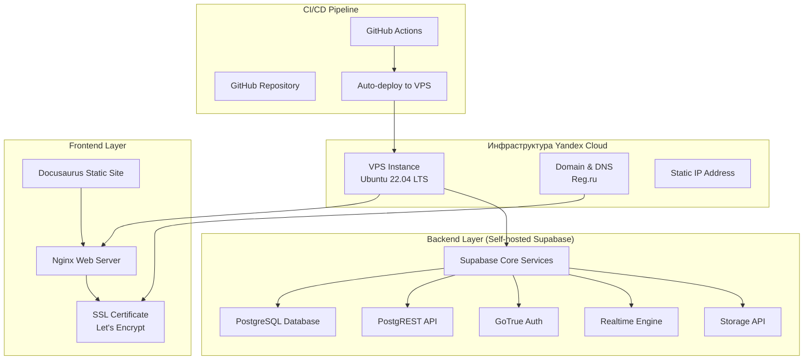

# 🆕 **ОБНОВЛЕННАЯ АРХИТЕКТУРА: SELF-HOSTED SUPABASE НА YANDEX CLOUD VPS**

## **Новая архитектурная схема:**

## **Преимущества новой архитектуры:**

1. **Полный контроль:** Все данные и сервисы находятся в России
2. **Совместимость:** Supabase API остается стандартным
3. **Масштабируемость:** Возможность вертикального и горизонтального масштабирования
4. **Безопасность:** Данные не покидают российскую юрисдикцию
5. **Стоимость:** Оптимальное соотношение цена/качество

## **Технические требования VPS:**

- **CPU:** 4 vCPU (рекомендуется для Supabase)
- **RAM:** 8 GB (минимум для стабильной работы)
- **Storage:** 100 GB SSD (для базы данных и файлов)
- **Network:** 1 Gbps, статический IP
- **OS:** Ubuntu 22.04 LTS

## **План развертывания Supabase на VPS:**

1. **Подготовка VPS:**
   - Установка Docker и Docker Compose
   - Настройка firewall и безопасности
   - Создание пользователя для Supabase

2. **Развертывание Supabase:**
   - Клонирование официального репозитория
   - Настройка переменных окружения
   - Запуск всех сервисов

3. **Настройка Nginx:**
   - Reverse proxy для Supabase API
   - Статический хостинг для Docusaurus
   - SSL сертификаты

4. **Интеграция с Docusaurus:**
   - Обновление конфигурации
   - Настройка API endpoints
   - Тестирование функциональности

