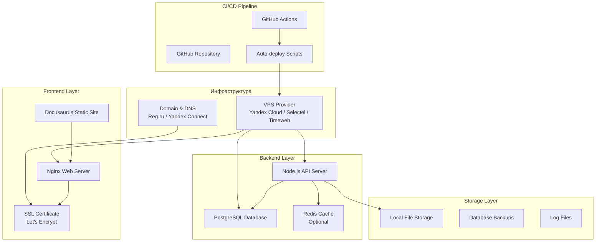

# ��️ **SELF-HOSTED АРХИТЕКТУРА: ДЕТАЛЬНАЯ РАЗРАБОТКА**

## �� **Архитектурная схема:**



## 🎯 **ТЕХНИЧЕСКИЕ СПЕЦИФИКАЦИИ:**

### **VPS требования:**
- **CPU:** 2 vCPU (минимум)
- **RAM:** 4 GB (минимум)
- **Storage:** 50 GB SSD
- **OS:** Ubuntu 22.04 LTS
- **Network:** 1 Gbps, статический IP

### **Программное обеспечение:**
- **Web Server:** Nginx 1.18+
- **Database:** PostgreSQL 15+
- **Runtime:** Node.js 18+ LTS
- **Process Manager:** PM2
- **Containerization:** Docker (опционально)
- **SSL:** Let's Encrypt (Certbot)

## 🔧 **ПЛАН РАЗВЕРТЫВАНИЯ:**

### **Этап 1: Подготовка VPS**
```bash